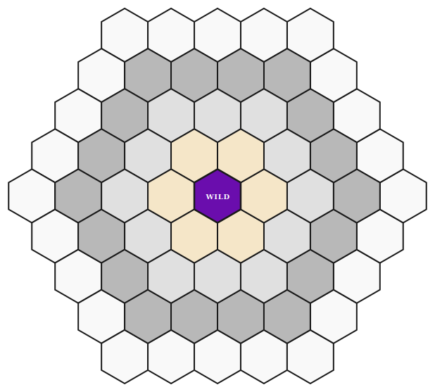

# Future Game Candidates

Games under consideration for the platform. All are 2-player abstract strategy with no hidden information.

---

<table>
<tr>
<td width="300" align="center">

</td>
<td>

### Tak
**Strategy: High**

Modern classic by James Ernest (from Patrick Rothfuss's *Kingkiller Chronicle*). Pieces can be flat stones, standing stones (walls), or a capstone. Stacking mechanic — you can move a stack and drop pieces along the way. Win by building a "road" connecting opposite edges. Walls block roads but capstones can flatten them. The stacking makes it very spatial. Growing tournament community. Might need thoughtful UI for the 3D stacking aspect.

</td>
</tr>
<tr>
<td width="300" align="center">

</td>
<td>

### Amazons
**Strategy: High**

Played on a 10x10 grid. Each player has 4 amazons (queens). On your turn, move one amazon like a chess queen, then it shoots a blocking arrow (also queen-movement) that permanently fills a square. The board shrinks every turn. Win by being the last player who can move. Territory and isolation game. Dramatic endgames where you wall off sections. Computationally interesting (PSPACE-complete). Clean to implement — just queens and burned squares.

</td>
</tr>
<tr>
<td width="300" align="center">

</td>
<td>

### Quoridor
**Strategy: Medium-High**

9x9 grid. Each player has a pawn starting at opposite edges. On your turn, either move your pawn one step or place a wall (2-square segment) anywhere on the board. You must never completely block a path to the goal. First pawn to reach the opposite edge wins. 10 walls each. The wall placement creates an emergent maze. Easy to learn, surprising depth. Would need pathfinding validation (no sealing off the goal). Mensa Select winner.

</td>
</tr>
<tr>
<td width="300" align="center">

</td>
<td>

### Tzaar
**Strategy: High**

GIPF series game on a hex board (60 intersections). Three piece types (tzaar, tzarra, tott) — you lose if any type is eliminated. Each turn: first move must capture, second move can capture or strengthen (stack on your own piece). Stacks move as one and can capture equal-or-shorter stacks. Constant tension between attacking and preserving your diversity. Clean rules, deep tactics. The GIPF series games are all tournament-quality.

</td>
</tr>
<tr>
<td width="300" align="center">

</td>
<td>

### Konane
**Strategy: Medium-High**

Hawaiian jumping game on a rectangular grid (various sizes, traditionally up to 13x20). Board starts fully packed in a checkerboard pattern. Two pieces are removed to start, then players alternate jumping (capturing) opponent pieces — like checkers but orthogonal only, with chain jumps. Whoever can't jump loses. Similar feel to Fanorona (mandatory capture, chain moves) but distinct enough. Culturally significant — Hawaiian royalty played this.

</td>
</tr>
<tr>
<td width="300" align="center">

</td>
<td>

### Hasami Shogi
**Strategy: Medium**

Japanese custodian-capture game on a 9x9 board. Each player has 9 or 18 pieces (variant-dependent). Capture by sandwiching — place pieces on both sides of an opponent along a line. Corner captures work too. Simple movement (rook-like slides). Win by capturing enough opponent pieces or forming five in a row (variant). Fast and aggressive. Clean implementation — basically Seega's cousin on a bigger board.

</td>
</tr>
<tr>
<td width="300" align="center">

</td>
<td>

### Fox and Geese
**Strategy: Medium**

Asymmetric hunt game on an alquerque or cross-shaped board. One fox (can jump and capture geese) vs. 13-17 geese (can only move forward/sideways, trying to corner the fox). The geese win by immobilizing the fox; the fox wins by eating enough geese. Simple rules, interesting asymmetric balance. Historically played across medieval Europe and Scandinavia. Several board variants to choose from.

</td>
</tr>
<tr>
<td width="300" align="center">

</td>
<td>

### Breakthrough
**Strategy: Medium**

Minimalist chess variant on an 8x8 board. Two rows of pieces per player. Pieces move one step forward (straight or diagonal) and capture diagonally forward only. First player to reach the opposite back rank wins. No draws possible. Very clean, very fast, surprisingly strategic for such simple rules. Designed by Dan Troyka specifically as a game with no draws. Good entry-level game for the platform.

</td>
</tr>
<tr>
<td width="300" align="center">

</td>
<td>

### Dao
**Strategy: Medium**

Only 4 pieces per player on a 4x4 grid. Pieces slide to the edge of the board in any direction (like rooks that can't stop mid-slide). Win by getting four in a row, four in a square, or four in the corners. Tiny game, fast rounds, but the forced-to-edge movement creates real puzzles. Could work as a "quick game" option alongside deeper titles. Very easy to implement.

</td>
</tr>
<tr>
<td width="300" align="center">

</td>
<td>

### Mu Torere
**Strategy: Low-Medium**

Maori game from New Zealand. Star-shaped board with 8 points around a center (kewai). Each player has 4 pieces. Pieces move to adjacent empty points, but you can only move to the center if your piece is adjacent to an opponent. Extremely simple — only 9 positions — but the restriction on center entry creates real tension. Might be too shallow for extended play. Could pair well as a quick warm-up game.

</td>
</tr>
<tr>
<td width="300" align="center">

</td>
<td>

### Agon (Queen's Guard)
**Strategy: Medium-High**

Played on a 6-ring hexagonal board (same 61-hex layout as Ouroboros). Each player has a queen and 6 guards. Goal: get your queen to the center hex with all 6 guards adjacent to her. Pieces move one step along hex edges. Capture by custodian (two pieces flanking an opponent force it to the edge). Since I already use this board for Ouroboros, would need to make the games feel distinct. Oldest known hex board game (19th century France).

</td>
</tr>
<tr>
<td width="300" align="center">

</td>
<td>

### Phalanx
**Strategy: Medium-High**

Group movement game. Connected groups of pieces move together as a unit. Captures by surrounding. The phalanx formation mechanic — where connected pieces gain strength — is unlike individual piece movement in my other games. Would need careful adjacency/group detection logic. Not as widely known, so less reference material available. Worth prototyping to see if it feels right.

</td>
</tr>
<tr>
<td width="300" align="center">

</td>
<td>

### Mak Yek
**Strategy: Medium**

Traditional Thai game on a 5x5 or larger grid. Custodian capture (sandwich). Each player fills their half of the board at setup. Pieces move one step orthogonally. The small board makes games quick and tactical. Less documented in English than Seega, but the mechanics overlap significantly. Might be redundant if I already build Seega. Worth comparing the two before committing.

</td>
</tr>
<tr>
<td width="300" align="center">

</td>
<td>

### Kuba
**Strategy: Medium-High**

Marble-pushing game on a 7x7 grid. Each player has 8 pieces plus 13 neutral red marbles. Push rows of marbles by sliding your piece into them. Win by pushing 7 red marbles off the board or pushing all opponent marbles off. No pushing a row back immediately (ko-like rule). Similar push mechanic to Abalone but on a square grid with the neutral marble element. Out of print but rules are well-documented.

</td>
</tr>
<tr>
<td width="300" align="center">

</td>
<td>

### Annuvin
**Strategy: Medium-High**

Hex-based game where each player has 5 pieces of different sizes (1-5). Larger pieces move fewer steps, smaller pieces move more. Goal: get any piece to the opponent's home hex, or eliminate enough opponent pieces. The size/mobility tradeoff creates interesting tension. Clean hex board. Not widely known — limited reference material. Huntsmen is the square-grid variant.

</td>
</tr>
<tr>
<td width="300" align="center">

</td>
<td>

### Bolix (Pente on Hex)
**Strategy: Medium-High**

Five-in-a-row on a hex grid with custodian capture (place stones to sandwich and remove pairs). Win by 5-in-a-row or by capturing 5 pairs. The hex geometry changes the line-of-sight calculations compared to standard Pente. Placement-only game (no movement phase), so the engine is simpler. Pente itself is well-understood; the hex variant adds a twist.

</td>
</tr>
</table>

---

**Notes to self:**
- Prioritize games with mechanics I don't already have (stacking, territory, enclosure, loop formation)
- Current mechanic coverage: displacement cycle (Ouroboros), milling (Morris), approach/withdrawal capture (Fanorona), connection (Lines of Action), pushing (Abalone), asymmetric regicide/race (Tablut)
- Biggest gaps: territory/area control, stacking, enclosure, loop formation
- Watch for overlap: Seega vs Hasami Shogi vs Mak Yek are all custodian-capture (Tablut already covers this mechanic)
- Konane might be too close to Fanorona (mandatory jumps, chain captures)
- Shogi intentionally left off - too many piece types and promotion rules for clean SVG UI
- Reversi left off - heavily served by existing apps, wouldn't stand out
- Tablut, Abalone, Lines of Action, Surakarta, and Seega have been built and moved off this list
