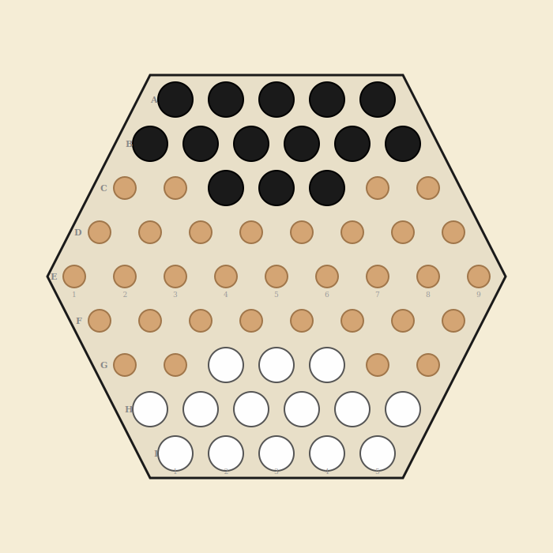

# Abalone

Marble-pushing strategy game - 61-hex board - 2 players

## Overview

Abalone is a two-player strategy game where each player controls 14 marbles on a hexagonal board. The goal is to push 6 of your opponent's marbles off the edge of the board. Pushing is only possible with numerical superiority in a line, making formation and positioning critical.

## Components

One hexagonal board with 61 spaces (5 per side) and 28 marbles total.

- **Black** - 14 marbles - moves first
- **White** - 14 marbles

## Board Layout



The board is a regular hexagon with 61 spaces arranged in 9 rows:

| Row | Spaces | Labels |
|-----|--------|--------|
| A (top) | 5 | A1-A5 |
| B | 6 | B1-B6 |
| C | 7 | C1-C7 |
| D | 8 | D1-D8 |
| E (center) | 9 | E1-E9 |
| F | 8 | F1-F8 |
| G | 7 | G1-G7 |
| H | 6 | H1-H6 |
| I (bottom) | 5 | I1-I5 |

Each space has up to 6 neighbors (the 6 hexagonal directions). Spaces on the board edge have fewer neighbors; marbles pushed beyond the edge are eliminated.

## Setup

### Classic starting position (default)

Each player fills their two back rows and places 3 marbles in the center of the third row:

| Side | Positions (14 marbles) |
|------|----------------------|
| Black | A1-A5 (5), B1-B6 (6), C3, C4, C5 (3) |
| White | I1-I5 (5), H1-H6 (6), G3, G4, G5 (3) |

### Belgian Daisy (tournament variant)

Each player places two flower-shaped clusters of 7 marbles on opposite sides of the board. This setup leads to more aggressive openings and was designed to reduce drawn-out defensive play. Used in official AbaCup tournaments.

## Movement

On each turn, a player moves **1, 2, or 3 of their marbles**. The marbles being moved must form a connected line on the board. There are two types of moves:

### In-line move

Move a line of 1, 2, or 3 marbles in the direction of the line (forward or backward along the axis they are aligned on). The lead marble moves into an empty space, and the others follow.

- A single marble moves to any adjacent empty space.
- A group of 2 or 3 marbles moves along its own axis (the line connecting them).
- The destination space for the lead marble must be empty, unless pushing (see Sumito below).

### Broadside move (side-step)

Move a line of 2 or 3 marbles sideways (perpendicular to the axis they are aligned on). All marbles in the group shift one space in the same direction.

- Every destination space must be empty.
- **Broadside moves cannot push opponent marbles.** Pushing only happens with in-line moves.

## Pushing (Sumito)

When making an in-line move, your group can push opponent marbles if you have **numerical superiority**. The pushed marbles must be directly ahead of your group along the same line.

### Valid pushes

| Your group | Opponent marbles | Result |
|------------|-----------------|--------|
| 2 marbles | 1 marble | Push (2 vs 1) |
| 3 marbles | 1 marble | Push (3 vs 1) |
| 3 marbles | 2 marbles | Push (3 vs 2) |

### Invalid pushes

| Situation | Why |
|-----------|-----|
| 1 vs 1 | No numerical superiority |
| 2 vs 2 | Equal groups cannot push |
| 3 vs 3 | Equal groups cannot push |
| Any vs 3 | A group of 3 is the maximum; nothing can push it |
| Opponent backed by friendly marble | Cannot push through your own marbles |
| Opponent backed by another opponent marble beyond the valid push count | Cannot push more marbles than you have superiority for |

> **Pushing is always optional.** Even when a push is available, you may choose a different move instead.

> **Safe to move into:** Moving your marble into a gap between opponent marbles does not cause anything to happen. Only the active player's in-line moves with numerical superiority result in pushes.

### Pushing off the board

If a pushed marble has no space behind it (it is on the board edge and being pushed outward), it is **permanently eliminated**. Eliminated marbles do not return to the game.

## Winning

| Condition | Result |
|-----------|--------|
| Push 6 opponent marbles off the board | You win |

The game ends immediately when a player's 6th marble is pushed off.

## Draws

Abalone has no built-in draw mechanism, which is a known weakness. Defensive formations (particularly the "turtle" or wedge) can stall games indefinitely. For the digital implementation, the following draw rules are recommended:

- **Move limit:** If no marble is pushed off within 200 moves, the game is a draw. (Configurable.)
- **Repetition:** If the same position occurs 3 times with the same player to move, the game is a draw.
- **Agreement:** Both players may agree to a draw at any time.

> **Warning:** **Draw prevention:** The Belgian Daisy starting position was designed specifically to reduce stalemate situations. Consider making it the default or offering it as an option.

---

## Implementation Notes

### Settings

| Setting | Default | Description |
|---------|---------|-------------|
| Starting position | Classic | Classic or Belgian Daisy |
| Move limit | 200 | Moves with no elimination before draw (0 = off) |
| Threefold repetition | On | Draw if same position repeats 3 times |

### Game state shape

```
{
  accessCode, game: 'abalone',
  phase: 'waiting' | 'playing' | 'finished',
  players: {
    p1: { token, ip, name, title, eliminated: 0 },  // Black
    p2: { token, ip, name, title, eliminated: 0 }   // White
  },
  board: { 'A1': 'p1', 'I5': 'p2', 'E5': null, ... },
  turn: { player: 'p1' },
  settings: { layout: 'classic', moveLimit: 200, drawByRepetition: true },
  movesSinceElimination: 0,
  positionHistory: {},
  log: [], logSeq: 0,
  result: null,
  requests: 0
}
```

### Board data model

- **Node naming:** Row letter + column number. A1 through I5. 61 valid positions total.
- **Adjacency:** 6 hex directions per space. Edge spaces have 2-5 neighbors; pushing beyond a missing neighbor = off the board.
- **Edge detection:** A space is on the edge if it has fewer than 6 neighbors. Critical for push-off detection.
- **Line detection:** For move validation, need to identify lines of 2-3 aligned marbles along any of the 3 hex axes, and what lies beyond each end of the line.

### Move representation

A move consists of:

- **Marbles:** 1, 2, or 3 marble positions (must be aligned)
- **Direction:** One of 6 hex directions
- **Type:** inline or broadside (derived from marble positions vs direction)

The engine must determine whether the move is a simple slide, a broadside, or a push (and if so, what gets pushed and whether anything falls off the edge).

### Phase machine

- `waiting` -> player 2 joins -> `playing`
- `playing` -> 6th marble eliminated -> `finished`
- `playing` -> move limit or repetition -> `finished` (draw)

### API endpoints

- `create`, `join`, `state`, `leave`, `stats`, `replay` (standard)
- `move` (marbles[], direction) - single game-specific action

### UI considerations

- Selecting multiple marbles: click first marble, then click second (auto-selects line between them), then click direction to move. Or click marble then click destination.
- Show eliminated marble count prominently (it is the score).
- Highlight pushable opponent marbles when a valid sumito is available.
- Animate pushes (marbles sliding in sequence) for clarity.
- Edge gutter/trough visual to show where marbles fall off.
