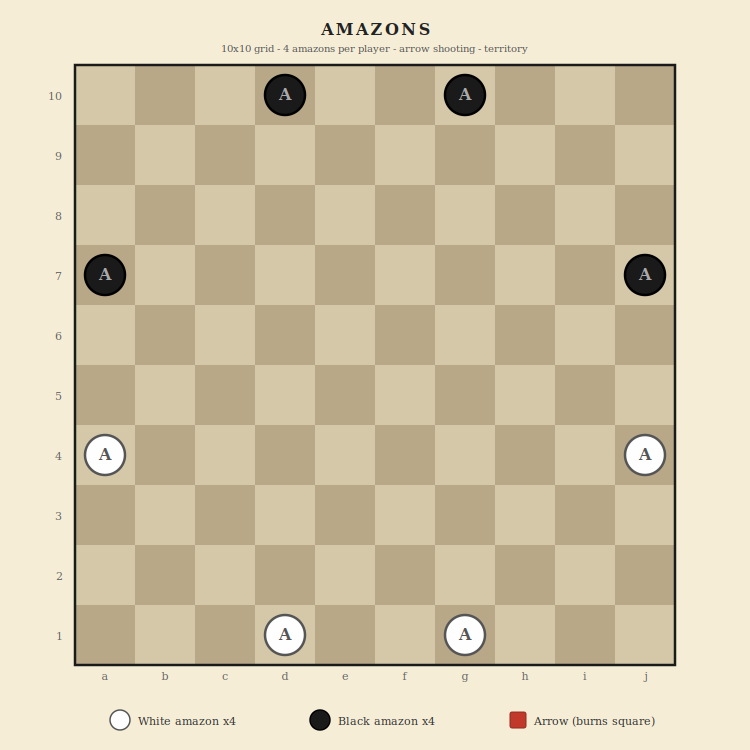

# Amazons

Territory strategy game - 10x10 grid - arrow shooting - 2 players

## Overview

The Game of the Amazons was invented by Walter Zamkauskas in 1988. Each player controls 4 amazons on a 10x10 board. On each turn, a player moves one amazon like a chess queen, then that amazon shoots an arrow (also queen-movement) that permanently blocks a square. As arrows accumulate, the board shrinks and territory becomes the decisive resource. The last player able to move wins.

## Components

One 10x10 board (100 squares) and 8 amazons total. No pieces are ever removed.

- **Player 1 (White)** - 4 white amazons - moves first
- **Player 2 (Black)** - 4 black amazons

## Board Layout



Standard 10x10 grid using algebraic notation: files a-j (left to right), ranks 1-10 (bottom to top).

## Setup

| Side | Positions |
|------|-----------|
| White | a4, d1, g1, j4 |
| Black | a7, d10, g10, j7 |

The amazons start in a symmetric pattern with each player's pieces along their two nearest edges.

## Turn Structure

Each turn has **two mandatory parts**:

1. **Move an amazon:** Choose one of your amazons and move it any number of squares in a straight line (horizontal, vertical, or diagonal), like a chess queen. Cannot pass through or land on other amazons or arrows.

2. **Shoot an arrow:** From the amazon's new position, shoot an arrow in any straight line (again, queen movement). The arrow lands on any reachable empty square and **permanently blocks** that square for the rest of the game. Cannot shoot through amazons or other arrows.

Both parts are mandatory. You must move, then shoot.

## Arrows

- Arrows are permanent. Once placed, they never move or disappear.
- No piece can move through or land on an arrow.
- Arrows are shown as burned/blocked squares on the board.
- As the game progresses, the board fills with arrows and available space shrinks.

## Winning

| Condition | Result |
|-----------|--------|
| You make a legal move (move + shoot) | Game continues |
| You cannot move any amazon on your turn | You lose |

The last player to make a legal move wins. There are no draws - one player always runs out of moves.

## No Captures

Amazons has no capture mechanic. All 8 amazons remain on the board for the entire game. The game is purely about territorial control through arrow placement.

---

## Strategy Notes

The game is about territory. Each arrow divides the board further. Strong play involves:
- Claiming large open regions for your amazons while restricting opponents to smaller ones.
- Shooting arrows that wall off sections of the board.
- Keeping your amazons mobile while trapping your opponent's.
- The endgame often involves counting the number of moves available to each player in their isolated territories.

---

## Implementation Notes

### Settings

| Setting | Default | Description |
|---------|---------|-------------|
| (none) | | Amazons has no optional rules or configurable settings |

### Game state shape

```
{
  accessCode, game: 'amazons',
  phase: 'waiting' | 'playing' | 'finished',
  players: {
    p1: { token, ip, name, title },
    p2: { token, ip, name, title }
  },
  board: { 'a4': 'p1', 'a7': 'p2', 'd5': 'arrow', ... },
  turn: { player: 'p1', action: 'move' | 'shoot', amazon: null },
  log: [], logSeq: 0,
  result: null,
  requests: 0
}
```

Board values: `'p1'` (white amazon), `'p2'` (black amazon), `'arrow'` (burned square), `null` (empty).

### Turn action state machine

Each turn has two sub-actions:
- `action: 'move'` - player must select and move an amazon
- `action: 'shoot'` - player must shoot an arrow from the just-moved amazon

After the arrow is shot, turn switches to the opponent with `action: 'move'`.

### Board data model

- **Node naming:** Chess algebraic: a1 through j10. 100 squares.
- **Adjacency:** 8-directional queen movement. Generate all reachable squares by tracing in each direction until hitting an edge, amazon, or arrow.
- **Arrow count:** Increases by 1 every turn. Game typically lasts 80-92 turns.

### Phase machine

- `waiting` -> player 2 joins -> `playing` (p1 moves first, action='move')
- `playing` -> player moves amazon -> action='shoot', amazon=moved piece
- `playing` -> player shoots arrow -> check if opponent can move -> switch turn or finish
- `playing` -> opponent cannot move -> `finished`

### API endpoints

- `create`, `join`, `state`, `leave`, `stats`, `replay` (standard)
- `move` (from, to) - move an amazon (during 'move' action)
- `shoot` (target) - shoot an arrow (during 'shoot' action)

### UI considerations

- Two-click turn: first click selects and moves amazon (shows queen reachable squares), second click shoots arrow (shows queen reachable from new position).
- Arrows should be visually distinct from amazons - use a different shape (X mark, fire icon, or filled square with a different color).
- Show the number of arrows placed as a turn counter.
- The currently-moved amazon (waiting for arrow shot) should be highlighted distinctly.
