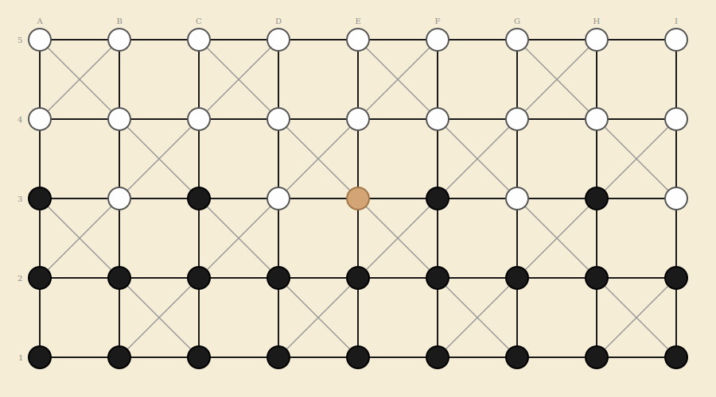

# Fanorona

Traditional Malagasy strategy game - 5x9 grid - 45 intersections - 2 players

## Origin

Fanorona is a traditional board game from **Madagascar**, believed to date from around 1680. It is derived from Alquerque and is considered the national game of Madagascar. Legend holds that a Fanorona game decided the succession of the Merina monarchy.

## Components

One Fanorona board: a rectangular grid of **9 columns x 5 rows**, forming **45 intersections**. Lines connect adjacent intersections horizontally, vertically, and diagonally (diagonals exist only on a checkerboard subset of intersections). Each player has **22 pieces** of their color.

- **Player 1 (Black)** - 22 black pieces - occupies the near side (rows 1-2 and half of row 3)
- **Player 2 (White)** - 22 white pieces - occupies the far side (rows 4-5 and half of row 3)

## Board Layout

The board consists of a 9x5 grid of points connected by lines:

- **Horizontal and vertical lines** connect every pair of adjacent intersections in the same row or column.
- **Diagonal lines** connect some adjacent intersections diagonally. Diagonals exist in a **checkerboard pattern** - at intersections where the sum of the 1-indexed column and row numbers is even (e.g., A1 = 1+1 = 2, even -> has diagonals). This means roughly half the intersections have 8 connections (all directions) and the other half have only 4 (orthogonal only).

Columns are labeled **A-I** (left to right) and rows **1-5** (bottom to top). The center of the board is intersection **E3**.

## Initial Setup

All 44 pieces start on the board. Only the center intersection (E3) is empty:

| Row | Contents |
|-----|----------|
| Row 5 (top) | All 9 intersections occupied by **White** |
| Row 4 | All 9 intersections occupied by **White** |
| Row 3 (middle) | Alternating: **Black, White, Black, White, *empty*, Black, White, Black, White** (from left to right: A3-I3) |
| Row 2 | All 9 intersections occupied by **Black** |
| Row 1 (bottom) | All 9 intersections occupied by **Black** |

## Objective

Capture **all** of your opponent's pieces, or leave them with **no legal move**.

## Movement

White moves first. Players alternate turns. On each turn, a player either makes a **capturing move** (mandatory if available) or a **paika** (non-capturing move, only if no capture is possible).

### Basic Movement (Paika)

A paika move slides one of your pieces **one step** along any drawn line (horizontal, vertical, or diagonal if a diagonal exists at that point) to an **adjacent empty intersection**. This is allowed **only when no capturing move exists anywhere on the board**.

## Capturing

Capturing is the heart of Fanorona. There are two types of capture, both based on the **line of movement**:

### Capture by Approach

Move your piece **toward** an opponent's piece along a line. Your piece lands on the empty intersection adjacent to the enemy piece. All opponent pieces in an **unbroken line** extending beyond the landing point, in the **same direction** of movement, are captured and removed from the board.

> **Example:** Your piece at C3 moves right to D3. If D3 was empty and E3, F3, G3 are all occupied by opponent pieces (unbroken), then E3, F3, and G3 are all captured. If E3 and F3 are opponents but G3 is empty or your own piece, only E3 and F3 are captured.

### Capture by Withdrawal

Move your piece **away from** an opponent's piece along a line. All opponent pieces in an **unbroken line** extending from your piece's **original position**, in the **opposite direction** of movement, are captured and removed.

> **Example:** Your piece at D3 moves right to E3. If C3 and B3 are occupied by opponent pieces (unbroken line to the left, opposite of the rightward move), then C3 and B3 are captured.

### Choosing Between Approach and Withdrawal

If a single move could capture by **both** approach and withdrawal simultaneously, the player **must choose one**. You cannot capture in both directions with the same move.

## Chain Captures (Multi-Capture Turns)

After making a capturing move, if the **same piece** can make another capture from its new position, it **must** continue capturing. This creates a chain (relay) of captures in a single turn. The chain continues as long as further captures are possible.

### Chain Capture Restrictions

- The **same piece** must make all captures in the chain.
- The piece must **change direction** with each step in the chain - you cannot move in the same direction twice consecutively.
- The piece **may not land on the same intersection twice** during the chain.
- A player **may voluntarily end** a capture chain early, forfeiting remaining captures. (This is a strategic choice - sometimes capturing more pieces is disadvantageous.)

> **Warning:** **Mandatory capture:** If any capturing move exists on the board at the start of your turn, you **must** capture. You may choose *which* piece to move and *which* capture to make, but you cannot make a paika move when a capture is available.

## Winning

A player wins when:

- The opponent has **no pieces remaining** on the board.
- The opponent has **no legal move** on their turn.

## Draws

- The game is a **draw** by mutual agreement.
- Optional: the game is a draw if **no capture** has been made in the last 50 moves (25 per player).
- Optional: the game is a draw by **threefold repetition** - if the same board position occurs 3 times with the same player to move.

## Diagonal Connectivity Reference

Intersections with diagonal connections (where row + column index is even):

| Row | Intersections with diagonals |
|-----|------------------------------|
| Row 5 | A5, C5, E5, G5, I5 |
| Row 4 | B4, D4, F4, H4 |
| Row 3 | A3, C3, E3, G3, I3 |
| Row 2 | B2, D2, F2, H2 |
| Row 1 | A1, C1, E1, G1, I1 |

All other intersections connect only horizontally and vertically (4 neighbors max).

## Summary of Turn Structure

| Situation | Action |
|-----------|--------|
| Capture possible anywhere on board | **Must capture.** Choose a piece and make a capturing move (approach or withdrawal). |
| After a capture, same piece can capture again | **Must continue** (or voluntarily stop the chain). Must change direction; cannot revisit a point. |
| No capture possible anywhere | Make a **paika** move (slide one piece one step to an adjacent empty point). |

## Implementation Notes

### Multiplayer via Access Code

Same pattern as Ouroboros and 9 Men's Morris: one player creates a game and receives an access code. The second player joins by entering it. Both see the board in real time.

### Persistent Move Storage

Every move and capture is saved as it happens. Games can be paused and resumed across sessions.

### Game Settings (configurable at game creation)

- **Draw by repetition:** Enabled / Disabled (default: Enabled)
- **Move limit for draw:** 50 moves with no capture (default: Enabled)

### Game State

At any point the game state consists of:

- Board position (which pieces occupy which of the 45 intersections)
- Pieces captured from each player
- Whose turn it is
- Whether the current player is mid-chain-capture (and which piece is active)
- The direction of the last capture in the chain (to enforce direction change)
- Intersections visited during the current chain (to prevent revisiting)
