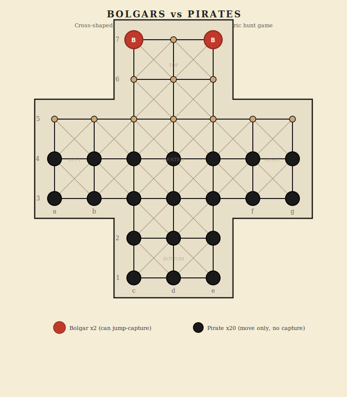

# Bolgars vs Pirates

Asymmetric hunt game - cross-shaped Alquerque board - 33 positions - 2 players

## Overview

An asymmetric hunt game played on a cross-shaped board made of 5 interconnected Alquerque squares (each 3x3 = 9 intersections). Two Bolgars (the hunters) try to capture enough Pirates to survive. Twenty Pirates (the prey) try to surround and trap the Bolgars so they cannot move. The Bolgars can jump-capture; the Pirates can only move.

## Components

One cross-shaped board with 33 intersections and 22 pieces total.

- **Bolgars** (Player 1) - 2 red pieces - start in the top square - can capture by jumping
- **Pirates** (Player 2) - 20 black pieces - fill the lower board - move only, cannot capture

## Board Layout



The board is a plus-sign shape made from 5 overlapping 3x3 Alquerque sub-squares:

```
      [TOP]
[LEFT][CENTER][RIGHT]
      [BOTTOM]
```

Each sub-square is a 3x3 grid (9 intersections) with horizontal, vertical, and diagonal connections. Adjacent sub-squares share their connecting edge (3 positions), giving 33 unique positions total.

### Coordinate system

Columns a-g, rows 1-7. Only cross-shaped positions are valid:

```
Row 7:       c7  d7  e7
Row 6:       c6  d6  e6
Row 5: a5 b5 c5  d5  e5 f5 g5
Row 4: a4 b4 c4  d4  e4 f4 g4
Row 3: a3 b3 c3  d3  e3 f3 g3
Row 2:       c2  d2  e2
Row 1:       c1  d1  e1
```

### Connections

Pieces move along the drawn lines. Each intersection connects to its orthogonal neighbors (up, down, left, right) and to diagonal neighbors within the same Alquerque sub-square. Diagonal connections follow the standard Alquerque pattern: diagonals exist where both row and column indices have the same parity.

## Setup

| Side | Starting positions |
|------|-------------------|
| Bolgars (2) | c7, e7 (top corners of the top square) |
| Pirates (20) | All positions in rows 1-4: c1, d1, e1, c2, d2, e2, a3, b3, c3, d3, e3, f3, g3, a4, b4, c4, d4, e4, f4, g4 |

Row 5 and the top square (except the Bolgars) start empty. This gives the Bolgars room to maneuver and the Pirates a solid mass to advance from.

## Movement

### Bolgars

- Move one step along any connected line (horizontal, vertical, or diagonal) to an adjacent empty intersection.
- Can move in any direction (forward, backward, sideways, diagonally).
- Can also **capture by jumping** (see Capture below).

### Pirates

- Move one step along any connected line to an adjacent empty intersection.
- Can move in any direction (not restricted to forward-only).
- **Cannot capture.** Pirates never jump over or remove Bolgars.

## Capture

Only Bolgars can capture. A Bolgar captures by **jumping over** an adjacent Pirate along a connected line, landing on the empty intersection beyond. The jumped Pirate is removed from the board.

- The Pirate must be adjacent along a connected line.
- The landing square must be empty.
- Multiple chain jumps are allowed in the same turn (like checkers), but each jump must follow a connected line.
- Chain jumps can change direction between jumps.
- Captures are **not mandatory**. A Bolgar may choose to make a regular move instead of capturing.

## Winning

| Side | Win condition |
|------|--------------|
| Bolgars | Capture enough Pirates that the remaining Pirates cannot trap both Bolgars (typically when fewer than ~5 Pirates remain) |
| Pirates | Trap both Bolgars so neither can make a legal move |

In practice, the game ends when:
- Both Bolgars are immobilized (Pirates win), OR
- The Pirates concede they cannot trap the Bolgars (Bolgars win), OR
- A move limit is reached and the side with the positional advantage wins

For the digital implementation, the game ends when both Bolgars have no legal moves (Pirates win). A configurable move limit handles the case where Bolgars keep evading but cannot be trapped (default: 200 moves without capture).

---

## Strategy Notes

**For Bolgars:** Stay mobile. Keep your two Bolgars working together to create double-capture threats. Avoid getting pushed into corners of the cross arms where escape routes are limited. Jump aggressively early to thin out the Pirates before they can form a wall.

**For Pirates:** Advance as a united front. Use the narrow arms of the cross to funnel the Bolgars into dead ends. Don't spread out too thin or the Bolgars will pick off isolated Pirates. Sacrifice a few Pirates to corner a Bolgar against the board edge.

---

## Implementation Notes

### Settings

| Setting | Default | Description |
|---------|---------|-------------|
| Move limit | 200 | Moves without capture before draw (0 = off) |
| Chain captures | On | Bolgars can make multiple jumps per turn |

### Game state shape

```
{
  accessCode, game: 'fox-and-geese',
  phase: 'waiting' | 'playing' | 'finished',
  players: {
    p1: { token, ip, name, title, captured: 0 },        // Bolgars
    p2: { token, ip, name, title, piecesLeft: 20 }       // Pirates
  },
  board: { 'c7': 'p1', 'd4': 'p2', ... },
  turn: {
    player: 'p1',
    chain: null     // { piece, jumpsMade } when mid-chain capture
  },
  settings: { moveLimit: 200, chainCaptures: true },
  movesSinceCapture: 0,
  log: [], logSeq: 0,
  result: null,
  requests: 0
}
```

### Board data model

- **Node naming:** Columns a-g, rows 1-7. Only 33 cross-shaped positions are valid.
- **Adjacency:** Orthogonal connections between all adjacent valid positions. Diagonal connections within each 3x3 sub-square following Alquerque rules.
- **Sub-square membership:** Each position belongs to 1 or 2 sub-squares (edge positions are shared). Diagonal connections exist only within the same sub-square.
- **Jump detection:** For each Bolgar, check all connected directions. A valid jump requires: adjacent position has a Pirate, and the position beyond (in the same direction) is empty and on the board.

### Phase machine

- `waiting` -> player 2 joins -> `playing` (Bolgars move first)
- `playing` -> both Bolgars immobilized -> `finished` (Pirates win)
- `playing` -> move limit reached -> `finished` (most pieces or Bolgars win)
- `playing` -> mid-chain -> player can continue jumping or end chain

### API endpoints

- `create`, `join`, `state`, `leave`, `stats`, `replay` (standard)
- `move` (from, to) - move or jump
- `endchain` - end a chain capture voluntarily
