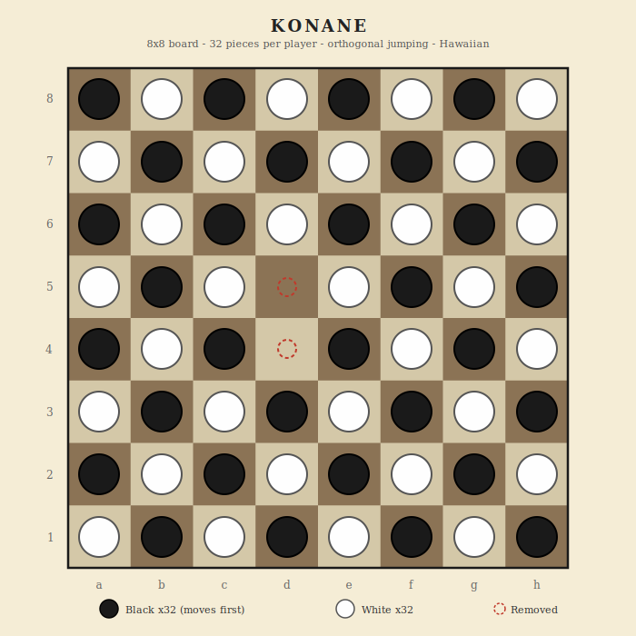

# Konane

Hawaiian jumping game - 8x8 board - orthogonal captures - chain jumps

## Overview

Konane is a traditional Hawaiian strategy game played on an 8x8 board. The board starts completely filled in a checkerboard pattern. Two pieces are removed to create the first gaps, then players take turns jumping over opponent pieces orthogonally to capture them. Chain jumps are allowed but must continue in the same direction. The player who cannot jump on their turn loses.

## Components

One 8x8 board (64 squares) and 64 pieces total.

- **Player 1 (Black)** - 32 black pieces - moves first
- **Player 2 (White)** - 32 white pieces

## Board Layout



Standard 8x8 grid using chess notation: files a-h, rows 1-8. The board shows a sample opening with two center pieces removed.

## Setup

1. Fill the entire board in a **checkerboard pattern** (alternating black and white, all 64 squares occupied).
2. **Black removes one piece** from either the center of the board (d4 or e5) or any corner (a1, a8, h1, h8).
3. **White removes one piece** that is orthogonally adjacent (up, down, left, or right) to the space Black just emptied.
4. The game begins with 62 pieces on the board and 2 empty spaces.

## Movement

All moves are **orthogonal jumps** (horizontal or vertical). No diagonal movement.

On each turn, a player **must** jump one of their pieces over an adjacent opponent piece, landing on the empty space beyond it. The jumped piece is captured and permanently removed from the board.

### Chain jumps

After making a jump, if the same piece can make another jump **in the same direction**, it may continue. Multiple jumps in a single turn are allowed, as long as:

- Every jump is in the **same direction** (all north, all south, all east, or all west).
- Each jump captures one opponent piece.
- The player may **stop a chain voluntarily** at any point, but must make at least one jump per turn.

> **No direction changes.** You cannot jump east then north in the same turn. All jumps in a chain must follow one straight line.

> **Jumps are mandatory.** If you can jump, you must. There are no non-capturing moves in Konane.

## Winning

| Condition | Result |
|-----------|--------|
| You make the last legal jump | You win |
| You cannot jump on your turn | You lose |

There are no draws. Every game ends with one player unable to move.

---

## Strategy Notes

Konane is about controlling the flow of captures. Unlike checkers, all jumps must be in a straight orthogonal line (no direction changes). This makes board geometry critical. Creating long chains of captures in favorable directions while denying your opponent's jump opportunities is the core skill. The opening removal choices set the tone for the entire game.

---

## Implementation Notes

### Settings

| Setting | Default | Description |
|---------|---------|-------------|
| Board size | 8x8 | Could also support 6x6 or 10x10 |
| Chain jumps | On | Traditional rules allow same-direction chain jumps |

### Game state shape

```
{
  accessCode, game: 'konane',
  phase: 'waiting' | 'removing' | 'playing' | 'finished',
  players: {
    p1: { token, ip, name, title, captured: 0, piecesLeft: 32 },
    p2: { token, ip, name, title, captured: 0, piecesLeft: 32 }
  },
  board: { 'a1': 'p1', 'a2': 'p2', ... },
  turn: {
    player: 'p1',
    action: 'remove' | 'jump',
    chain: null   // { piece, direction, jumpsMade } when mid-chain
  },
  removals: 0,     // 0, 1, or 2 removals completed
  log: [], logSeq: 0,
  result: null,
  requests: 0
}
```

### Board data model

- **Node naming:** Chess algebraic: a1 through h8. 64 squares.
- **Adjacency:** 4-connected (orthogonal only). No diagonals.
- **Initial board:** Checkerboard pattern. Black on (file+rank) even sums, white on odd sums (or vice versa).
- **Jump detection:** For each piece, check 4 directions. A valid jump requires: adjacent square has an opponent piece, and the square beyond it is empty.
- **Chain detection:** After a jump, check if the same piece can jump again in the same direction.

### Phase machine

- `waiting` -> player 2 joins -> `removing` (Black removes first piece)
- `removing` -> Black removes 1 piece -> White removes adjacent piece -> `playing`
- `playing` -> jump (possibly chain) -> check if opponent can jump -> switch turn or `finished`

### API endpoints

- `create`, `join`, `state`, `leave`, `stats`, `replay` (standard)
- `remove` (node) - remove a piece during setup (2 removals total)
- `move` (from, to) - jump a piece (engine detects chain opportunities)
- `endchain` - end a chain jump voluntarily

### UI considerations

- During removal phase, highlight valid removal targets (center/corners for Black, adjacent empty for White).
- During play, show all jumpable pieces. When selected, show valid jump destinations.
- When mid-chain, highlight the active piece and show the "End Chain" button. Only show jumps in the same direction.
- Animate the jump path (piece hops over captured pieces).
