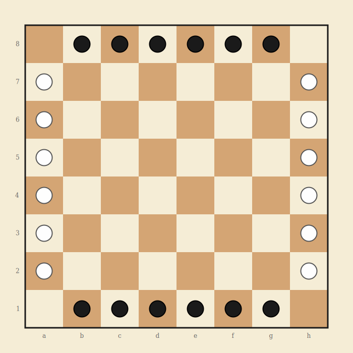

# Lines of Action

Connection strategy game - 8x8 board - 2 players

## Overview

Lines of Action (LOA) is a two-player connection game invented by Claude Soucie and popularized by Sid Sackson in *A Gamut of Games* (1969). The goal is to connect all of your remaining pieces into a single contiguous group. The movement mechanic is unique: a piece moves exactly as many squares as there are pieces (of either color) on its line of movement.

## Components

One standard 8x8 board (chess/checkerboard) and 24 pieces total.

- **Black** - 12 pieces - top and bottom edges - moves first
- **White** - 12 pieces - left and right edges

## Board Layout



Standard 8x8 grid using chess notation: files a-h (left to right), ranks 1-8 (bottom to top). The four corner squares (a1, h1, a8, h8) are always empty at the start.

## Setup

Each player's 12 pieces line the two opposite edges of the board, excluding corners:

| Side | Positions (12 pieces) |
|------|----------------------|
| Black | b1, c1, d1, e1, f1, g1 (bottom edge), b8, c8, d8, e8, f8, g8 (top edge) |
| White | a2, a3, a4, a5, a6, a7 (left edge), h2, h3, h4, h5, h6, h7 (right edge) |

Black's pieces span the horizontal edges. White's pieces span the vertical edges. This creates an interlocking cross pattern.

## Movement

On each turn, a player moves **one of their pieces** in a straight line (horizontal, vertical, or diagonal). The number of squares the piece moves is determined by counting **all pieces (friendly and enemy) along the entire line** in the chosen direction.

### Counting pieces on the line

The "line" is the full row, column, or diagonal that the piece would travel along. Count every piece on that line, including:

- The moving piece itself
- All friendly pieces on the line (in both directions)
- All enemy pieces on the line (in both directions)

The piece then moves **exactly that many squares** in the chosen direction. Not more, not less.

### Jumping and blocking

- A piece **may jump over friendly pieces** along its path.
- A piece **may NOT jump over enemy pieces**. If an enemy piece is in the path before the destination, the move is illegal.
- The destination must be either **empty** or occupied by an **enemy piece** (which is captured).
- A piece **may NOT land on a friendly piece**.

> **Example:** A black piece is on d4. Along the d-file (vertical), there are 3 total pieces (of any color). Black must move this piece exactly 3 squares vertically, either to d7 (up) or d1 (down), provided the path is not blocked by enemy pieces and the destination is not a friendly piece.

## Capture

Landing on an enemy piece removes it from the board. Captured pieces do not return. Captures are not mandatory; they happen only when a piece lands on an occupied enemy square as part of a normal move.

> **Captures help your opponent.** Removing an enemy piece makes it easier for them to form a connected group with fewer pieces. Think carefully before capturing.

## Winning

| Condition | Result |
|-----------|--------|
| All your remaining pieces form a single contiguous group | You win |
| You are reduced to a single piece | You win (one piece is a connected group) |
| Your move connects both players simultaneously | You win (the moving player wins ties) |
| You have no legal moves | You lose |

### Connection

A group is **contiguous** if every piece can reach every other piece by stepping through adjacent pieces. Adjacency includes all 8 directions: horizontal, vertical, and diagonal (king-move adjacency in chess terms).

## Draws

- **Threefold repetition:** Same position with same player to move occurs 3 times.
- **Agreement:** Both players may agree to a draw.
- **Move limit:** 100 moves with no capture (configurable). Prevents indefinite play.

---

## Strategy Notes

LOA has an unusual strategic tension: capturing enemy pieces makes it *easier* for your opponent to connect. Strong play focuses on advancing your own pieces toward each other while disrupting your opponent's formations without needlessly reducing their piece count.

The counting mechanic means a crowded line produces long-range moves, while a sparse line produces short moves. As pieces are captured or repositioned, the movement distances change dynamically.

---

## Implementation Notes

### Settings

| Setting | Default | Description |
|---------|---------|-------------|
| Threefold repetition | On | Draw if same position repeats 3 times |
| Move limit | 100 | Moves with no capture before draw (0 = off) |

### Game state shape

```
{
  accessCode, game: 'lines-of-action',
  phase: 'waiting' | 'playing' | 'finished',
  players: {
    p1: { token, ip, name, title, captured: 0, piecesLeft: 12 },  // Black
    p2: { token, ip, name, title, captured: 0, piecesLeft: 12 }   // White
  },
  board: { 'b1': 'p1', 'a2': 'p2', ... },
  turn: { player: 'p1' },
  settings: { drawByRepetition: true, moveLimit: 100 },
  movesSinceCapture: 0,
  positionHistory: {},
  log: [], logSeq: 0,
  result: null,
  requests: 0
}
```

### Board data model

- **Node naming:** Chess algebraic notation: a1 through h8. 64 squares total.
- **Adjacency:** 8 directions (orthogonal + diagonal). Edge and corner squares have fewer neighbors.
- **Line counting:** For each of the 8 directions from a square, count all pieces on the full line (row, column, or diagonal) passing through that square. This count determines the move distance.
- **Connection detection:** Flood-fill from any piece of a player's color using 8-connectivity. If the flood reaches all of that player's pieces, they are connected.

### Move validation

1. Identify the direction of movement (1 of 8 directions from origin to destination).
2. Count all pieces (both colors) on the full line through the origin in that direction.
3. Verify the destination is exactly that many squares away.
4. Verify no enemy pieces block the path between origin and destination.
5. Verify the destination is empty or occupied by an enemy (not friendly).
6. Execute the move. If destination had an enemy piece, capture it.
7. Check if the moving player's pieces are now a single connected group (win check).
8. Check if the opponent's pieces are also connected (simultaneous connection: moving player wins).

### Phase machine

- `waiting` -> player 2 joins -> `playing`
- `playing` -> player's pieces connected -> `finished`
- `playing` -> player reduced to 1 piece -> `finished` (that player wins)
- `playing` -> no legal moves -> `finished` (that player loses)
- `playing` -> repetition or move limit -> `finished` (draw)

### API endpoints

- `create`, `join`, `state`, `leave`, `stats`, `replay` (standard)
- `move` (from, to) - single game-specific action

### UI considerations

- When a piece is selected, calculate legal destinations by counting pieces on each of the 8 lines and checking for blocking/landing validity. Highlight legal destinations.
- Show the piece count per line visually (small number near the selected piece for each direction) to help players understand why a move covers a specific distance.
- Highlight the connected group(s) of the current player to show progress toward winning.
- Use a distinct visual for captured pieces (score display, not a holding area, since captures are permanent).
