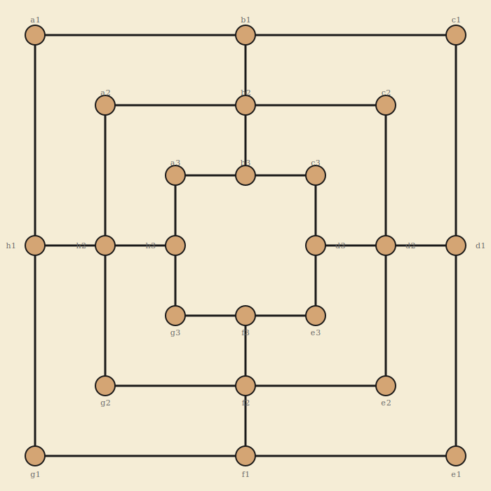

# Nine Men's Morris

Classic strategy game - 3 concentric squares - 24 intersections - 2 players

## Components

One Nine Men's Morris board (3 concentric squares connected at midpoints, forming 24 intersections). Each player has **9 pieces** (men) of their color.

- **Player 1 (Dark)** - 9 dark pieces
- **Player 2 (Light)** - 9 light pieces

## Board Layout

The board consists of three concentric squares connected by lines at the midpoints of each side. This creates **24 intersections** (nodes) where pieces may be placed. Each node connects to 2, 3, or 4 adjacent nodes along the drawn lines.

- **Outer square:** 8 nodes (4 corners + 4 midpoints)
- **Middle square:** 8 nodes (4 corners + 4 midpoints)
- **Inner square:** 8 nodes (4 corners + 4 midpoints)

The connecting lines at midpoints bridge adjacent rings, so the 4 midpoint positions on each side are connected across all three squares.

## Game Phases

The game has three distinct phases:

### Phase 1 - Placement

- Players alternate turns, starting with Player 1 (Dark).
- On each turn, place **one piece** from your hand onto any empty intersection.
- This phase ends when both players have placed all 9 pieces (18 turns total).
- If a mill is formed during placement, the player immediately removes one opponent piece (see *Mills* below).

### Phase 2 - Movement

- Players alternate turns.
- On each turn, slide **one of your pieces** along a line to an **adjacent empty intersection**.
- Pieces may only move to directly connected nodes - no jumping.
- If a mill is formed by the move, the player immediately removes one opponent piece (see *Mills* below).

### Phase 3 - Flying (optional variant)

- When a player is reduced to exactly **3 pieces**, that player may "fly" - move a piece to **any empty intersection** on the board, not just adjacent ones.
- The opponent (if they have more than 3 pieces) continues sliding normally.
- This phase is a widely-played variant. It should be **enabled by default** with an option to disable.

## Mills

A **mill** is a line of **3 of your pieces** along one of the board's drawn lines (a full side of any square, or a full connecting line across rings).

### The 16 possible mills

| Type | Mills |
|------|-------|
| Outer square (4) | a1-b1-c1, c1-d1-e1, e1-f1-g1, g1-h1-a1 |
| Middle square (4) | a2-b2-c2, c2-d2-e2, e2-f2-g2, g2-h2-a2 |
| Inner square (4) | a3-b3-c3, c3-d3-e3, e3-f3-g3, g3-h3-a3 |
| Cross-ring (4) | b1-b2-b3, d1-d2-d3, f1-f2-f3, h1-h2-h3 |

### Removing a piece

- When you form a mill, you **must** remove one of your opponent's pieces from the board.
- You **may not** remove a piece that is part of an opponent's mill, **unless** all of the opponent's pieces are in mills.
- Removed pieces are **permanently out of the game** (unlike Ouroboros, there is no restoration).

### Repeated mills

A player may "open" and "close" the same mill on successive turns. Each time the mill is re-formed (by moving a piece out and back, or sliding a different piece in), the player removes an opponent piece.

## Winning

A player wins when the opponent is reduced to one of the following conditions:

- **Fewer than 3 pieces** remaining (cannot form a mill).
- **No legal moves** on their turn (all pieces are blocked).

## Draws

- The game is a **draw** if both players agree.
- Optional: the game is a draw if **no mill has been formed and no piece removed** in the last 50 moves (25 per player). This prevents infinite loops.
- Optional: the game is a draw by **threefold repetition** - if the same board position occurs 3 times with the same player to move.

## Adjacency Reference

Each node and its connections:

| Node | Adjacent to |
|------|-------------|
| a1 | b1, h1 |
| b1 | a1, c1, b2 |
| c1 | b1, d1 |
| d1 | c1, e1, d2 |
| e1 | d1, f1 |
| f1 | e1, g1, f2 |
| g1 | f1, h1 |
| h1 | g1, a1, h2 |
| a2 | b2, h2 |
| b2 | a2, c2, b1, b3 |
| c2 | b2, d2 |
| d2 | c2, e2, d1, d3 |
| e2 | d2, f2 |
| f2 | e2, g2, f1, f3 |
| g2 | f2, h2 |
| h2 | g2, a2, h1, h3 |
| a3 | b3, h3 |
| b3 | a3, c3, b2 |
| c3 | b3, d3 |
| d3 | c3, e3, d2 |
| e3 | d3, f3 |
| f3 | e3, g3, f2 |
| g3 | f3, h3 |
| h3 | g3, a3, h2 |

## Implementation Notes

### Multiplayer via Access Code

Same pattern as Ouroboros: one player creates a game and receives an access code. The second player joins by entering it. Both see the board in real time.

### Persistent Move Storage

Every placement, move, and removal is saved as it happens. Games can be paused and resumed across sessions.

### Game Settings (configurable at game creation)

- **Flying:** Enabled / Disabled (default: Enabled)
- **Draw by repetition:** Enabled / Disabled (default: Enabled)
- **Move limit for draw:** 50 moves with no capture (default: Enabled)

### Game State

At any point the game state consists of:

- Board position (which pieces occupy which of the 24 nodes)
- Pieces in hand for each player (during Phase 1)
- Pieces captured from each player
- Current phase (placement / movement / flying per player)
- Whose turn it is
- Whether a mill was just formed (awaiting removal selection)
