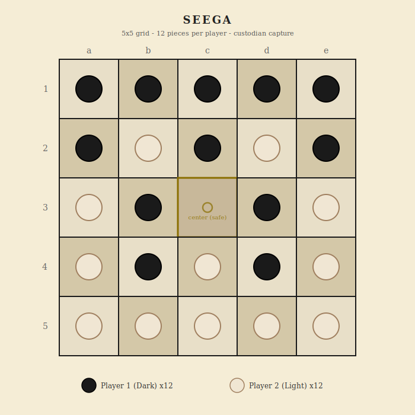

# Seega

Egyptian custodian-capture game - 5x5 grid - 2 phases - 2 players

## Overview

Seega is a traditional Egyptian strategy game played on a 5x5 grid. It has two phases: a placement phase where players fill the board (leaving the center empty), followed by a movement phase where pieces slide orthogonally and capture by sandwiching opponents between two of your pieces. The center square is a safe refuge where pieces cannot be captured.

## Components

One 5x5 board (25 squares) and 24 pieces total.

- **Player 1 (Dark)** - 12 dark pieces - places first
- **Player 2 (Light)** - 12 light pieces - moves first in the movement phase

## Board Layout



A 5x5 grid of squares using algebraic notation: columns a-e, rows 1-5. The center square (c3) is specially marked as a safe zone.

## Phase 1: Placement

Players take turns placing **2 pieces per turn** onto any empty squares except the center (c3).

- Player 1 places first.
- Each turn, place exactly 2 pieces anywhere on the board (except c3).
- Continue until all 24 pieces are placed (6 turns each, 12 turns total).
- The center square (c3) remains empty after placement.

The placement phase is strategic: where you place your pieces determines your options in the movement phase.

## Phase 2: Movement

After all pieces are placed, the movement phase begins.

- **Player 2 moves first** in the movement phase.
- Player 2's first move **must be to the center square** (move any adjacent piece to c3).
- After that, players alternate turns normally.
- On each turn, slide **one piece one square** horizontally or vertically to an adjacent empty square.
- No diagonal movement. No jumping.

### Capture

Capture happens by **custodian capture** (sandwiching). When you move a piece so that an opponent's piece is trapped between two of yours along a horizontal or vertical line, the opponent's piece is captured and removed from the board.

- A piece is only captured when an enemy **moves into** the sandwiching position. Being already between two enemies is safe.
- Multiple captures can happen in one move if the moving piece creates sandwiches in multiple directions.
- Diagonal sandwiches do not count.

### Center Square (c3)

- During placement: cannot be placed on.
- During movement: pieces may move onto and off the center square normally.
- A piece on the center square **cannot be captured**. It is a safe refuge.
- A piece on the center square **can participate in capturing** (it counts as one end of a sandwich).

### Multi-capture (chain)

After capturing, if the same piece can make another capture by moving one more step, it may continue. This allows chain captures in a single turn (similar to Fanorona's chain mechanic).

## Winning

| Condition | Result |
|-----------|--------|
| Capture all 12 opponent pieces | You win |
| Opponent has no legal moves | You win |

## Draws

- **Move limit:** If no capture is made for 20 consecutive moves (10 per player), the game ends. The player with more pieces on the board wins. If equal, it is a draw.
- **Repetition:** Threefold repetition of the same position with the same player to move is a draw.

---

## Implementation Notes

### Settings

| Setting | Default | Description |
|---------|---------|-------------|
| Move limit | 20 | Moves without capture before game ends (0 = off) |
| Threefold repetition | On | Draw if same position repeats 3 times |

### Game state shape

```
{
  accessCode, game: 'seega',
  phase: 'waiting' | 'placing' | 'playing' | 'finished',
  players: {
    p1: { token, ip, name, title, captured: 0, piecesLeft: 12, placed: 0 },
    p2: { token, ip, name, title, captured: 0, piecesLeft: 12, placed: 0 }
  },
  board: { ... },
  turn: { player: 'p1', action: 'place' | 'move', placedThisTurn: 0 },
  settings: { moveLimit: 20, drawByRepetition: true },
  movesSinceCapture: 0,
  positionHistory: {},
  firstMoveMade: false,
  log: [], logSeq: 0,
  result: null,
  requests: 0
}
```

### Board data model

- **Node naming:** Columns a-e, rows 1-5. a1 is top-left, e5 is bottom-right.
- **Adjacency:** 4-connected (orthogonal only). No diagonals for movement or capture.
- **Center square:** c3. Cannot be placed on. Safe from capture during movement.

### Phase machine

- `waiting` -> player 2 joins -> `placing` (player 1 places first)
- `placing` -> all 24 pieces placed -> `playing` (player 2 moves first, must move to center)
- `playing` -> all opponent pieces captured or no legal moves -> `finished`
- `playing` -> move limit or repetition -> `finished`

### API endpoints

- `create`, `join`, `state`, `leave`, `stats`, `replay` (standard)
- `place` (node) - place a piece during placement phase (2 per turn)
- `move` (from, to) - move a piece during movement phase
