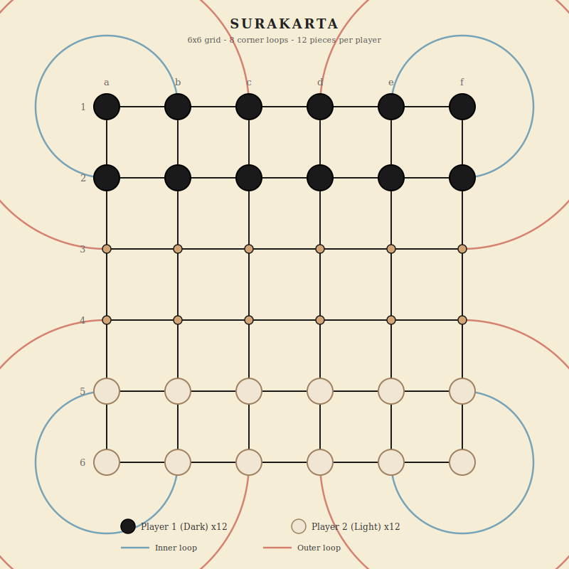

# Surakarta

Indonesian strategy game - 6x6 grid - loop-based capture - 2 players

## Overview

Surakarta (also called Roundabouts) is a traditional Indonesian board game named after the city of Surakarta in Java. The board is a 6x6 grid with 8 circular loop arcs at the corners. Pieces move simply (one step in any direction), but capturing is entirely different: to capture, a piece must travel along the grid lines and pass through at least one corner loop before landing on an opponent's piece. The loop-based capture mechanic is unlike any other abstract game.

## Components

One 6x6 board with 36 intersections, 8 corner loop arcs (4 inner, 4 outer), and 24 pieces total.

- **Player 1 (Dark)** - 12 dark pieces - starts on rows 1-2 (top)
- **Player 2 (Light)** - 12 light pieces - starts on rows 5-6 (bottom)

## Board Layout



A 6x6 grid of intersections with 8 three-quarter-circle loop arcs at the four corners. Each corner has two concentric loops:

- **Inner loops (blue, 4 arcs):** Connect the 2nd intersection from the corner along each adjacent edge. Radius covers 1 grid spacing.
- **Outer loops (red, 4 arcs):** Connect the 3rd intersection from the corner along each adjacent edge. Radius covers 2 grid spacings.

### Loop connection points

| Corner | Inner loop connects | Outer loop connects |
|--------|-------------------|-------------------|
| Top-left | b1 to a2 | c1 to a3 |
| Top-right | e1 to f2 | d1 to f3 |
| Bottom-left | a5 to b6 | a4 to c6 |
| Bottom-right | f5 to e6 | f4 to d6 |

The loops arc *outside* the grid (away from the center of the board). A piece entering a loop from one grid line exits onto the perpendicular grid line at the other end of the arc.

## Setup

| Side | Positions (12 pieces) |
|------|----------------------|
| Player 1 (Dark) | a1-f1 (all of row 1), a2-f2 (all of row 2) |
| Player 2 (Light) | a5-f5 (all of row 5), a6-f6 (all of row 6) |

Rows 3 and 4 are empty at the start.

## Movement

On each turn, a player either **moves** or **captures** (not both).

### Regular move

- Move one of your pieces **one step** to an adjacent empty intersection.
- Movement is allowed in all **8 directions**: horizontally, vertically, and diagonally.
- Cannot move onto an occupied intersection.
- Cannot jump over pieces.

### Capture move

Captures use the loop arcs. A piece captures by traveling along straight grid lines and through **at least one corner loop**, then landing on an opponent's piece. The captured piece is removed from the board.

**Capture rules:**
- The capturing piece travels along grid lines (horizontal or vertical) and loop arcs.
- It must pass through **at least one loop arc** during the capture path.
- The entire path (except the final destination) must consist of **empty intersections**. The piece cannot pass through any other piece, friendly or enemy.
- The destination must be an opponent's piece.
- The piece can traverse any number of straight grid lines and loops in a single capture, as long as the path is continuous and unblocked.
- A piece traveling along a loop enters via a grid line tangent to the loop, follows the arc, and exits onto the perpendicular grid line.

> **Captures are optional.** A player is never forced to capture even when one is available.

> **No straight-line captures.** You cannot capture by simply moving along a grid line without using a loop. The loop is what makes the capture legal.

## Winning

- **Primary:** First player to capture all 12 opponent pieces wins.
- **Stalemate:** If neither player can make progress, the player with more remaining pieces wins. This is typically determined by mutual agreement.

## Draws

- If both players have the same number of pieces and neither can capture, the game is a draw by agreement.
- A move limit can be used to prevent indefinite play (recommended: 200 moves with no capture).

---

## Strategy Notes

The loop capture mechanic creates long-range threats that are hard to see at first. A piece on the edge of the board, aligned with a loop entry point, can potentially capture any opponent piece along the exit line on the other side of the loop. Defensive play involves keeping pieces off the lines that connect through loops. Controlling the center (rows 3-4) is safer than the edges, since edge pieces are more exposed to loop captures.

---

## Implementation Notes

### Settings

| Setting | Default | Description |
|---------|---------|-------------|
| Move limit | 200 | Moves with no capture before draw (0 = off) |
| Threefold repetition | On | Draw if same position repeats 3 times |

### Game state shape

```
{
  accessCode, game: 'surakarta',
  phase: 'waiting' | 'playing' | 'finished',
  players: {
    p1: { token, ip, name, title, captured: 0, piecesLeft: 12 },
    p2: { token, ip, name, title, captured: 0, piecesLeft: 12 }
  },
  board: { 'a1': 'p1', 'a6': 'p2', ... },
  turn: { player: 'p1' },
  settings: { moveLimit: 200, drawByRepetition: true },
  movesSinceCapture: 0,
  positionHistory: {},
  log: [], logSeq: 0,
  result: null,
  requests: 0
}
```

### Board data model

- **Node naming:** Columns a-f, rows 1-6. a1 is top-left, f6 is bottom-right.
- **Adjacency (for regular moves):** 8-connectivity (orthogonal + diagonal). Edge/corner nodes have fewer neighbors.
- **Loop data structure:** Each loop is defined by its two endpoint nodes and the corner it wraps around. The engine needs a function that, given a starting node and a travel direction, traces the path along grid lines and through loops, returning all reachable capture targets.
- **Capture path tracing:** From any node, for each of the 4 orthogonal directions, trace along the grid line. When the path reaches a loop entry point, follow the arc to the exit point, then continue along the perpendicular grid line. Stop if a piece is encountered: if it's an opponent, that's a valid capture target; if it's friendly, the path is blocked.

### Loop definitions

```
Inner loops (radius 1):
  top-left:     b1 <-> a2  (arc outside corner a1)
  top-right:    e1 <-> f2  (arc outside corner f1)
  bottom-left:  a5 <-> b6  (arc outside corner a6)
  bottom-right: f5 <-> e6  (arc outside corner f6)

Outer loops (radius 2):
  top-left:     c1 <-> a3  (arc outside corner a1)
  top-right:    d1 <-> f3  (arc outside corner f1)
  bottom-left:  a4 <-> c6  (arc outside corner a6)
  bottom-right: f4 <-> d6  (arc outside corner f6)
```

A piece traveling along row 1 from right to left reaches b1, enters the top-left inner loop, travels the arc, and exits heading down along column a starting from a2.

### Phase machine

- `waiting` -> player 2 joins -> `playing`
- `playing` -> all opponent pieces captured -> `finished`
- `playing` -> move limit or repetition -> `finished` (draw)

### API endpoints

- `create`, `join`, `state`, `leave`, `stats`, `replay` (standard)
- `move` (from, to) - regular move (one step) or capture move (loop capture). The engine determines which type based on the distance and path.

### UI considerations

- Animate the loop capture path so the player can see the piece travel along grid lines and around the arc.
- Highlight all valid capture targets when a piece is selected (trace all loop paths from that piece).
- Color-code the inner and outer loops differently (blue/red as in the board reference) for visual clarity.
- Show the capture path preview when hovering over a valid target.
