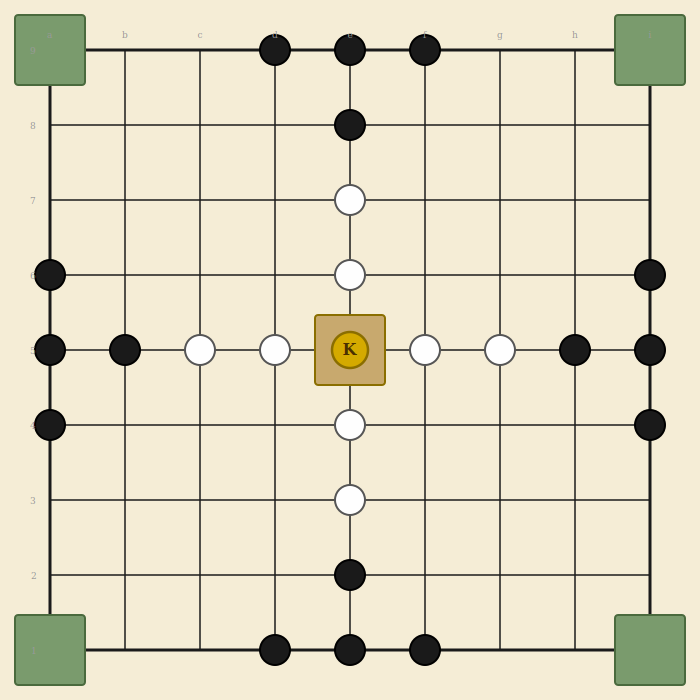

# Tablut

Viking strategy game - 9x9 grid - asymmetric - 2 players

## Overview

Tablut is a member of the Hnefatafl (Viking chess) family, documented by Carl Linnaeus during his 1732 expedition to Lapland. It is an **asymmetric** game: one side defends a king and tries to escort him to safety, while the other side commands a larger force trying to capture him.

## Components

One 9x9 board with 81 squares, 5 special squares (1 throne + 4 corners), and 25 pieces total.

- **Attackers (Muscovites)** - 16 dark pieces - surround and capture the king
- **Defenders (Swedes)** - 8 light pieces - protect the king
- **King** - 1 gold piece - must escape to a corner

## Board Layout



A standard 9x9 grid with five special squares:

- **Throne** (center square, e5): Only the king may occupy it. When empty, it is *hostile* to all pieces (counts as a capturing piece for custodian capture). Pieces may pass through the throne when it is empty but cannot stop on it.
- **Corners** (a1, a9, i1, i9): Only the king may land on these. Corner squares are always hostile (count as capturing pieces). If the king reaches any corner, the defenders win.

## Setup

Pieces are placed in a fixed starting position. The king sits on the throne with defenders in a cross around him. Attackers are arranged in groups of 4 at the center of each edge.

| Side | Positions |
|------|-----------|
| King | e5 (throne) |
| Defenders (8) | c5, d5, f5, g5 (horizontal arm), e3, e4, e6, e7 (vertical arm) |
| Attackers: top (4) | d9, e9, f9, e8 |
| Attackers: bottom (4) | d1, e1, f1, e2 |
| Attackers: left (4) | a4, a5, a6, b5 |
| Attackers: right (4) | i4, i5, i6, h5 |

## Movement

- Attackers move first. Players alternate turns after that.
- All pieces (including the king) move like a rook in chess: any number of empty squares in a straight line, horizontally or vertically.
- No diagonal movement. No jumping over other pieces.
- Only the king may land on the throne or corner squares.
- Other pieces may pass through the throne when it is empty, but cannot stop on it.

## Capture

Pieces are captured by **custodian capture** (sandwiching). To capture an enemy piece, move one of your pieces so that the enemy is trapped between two of your pieces along a horizontal or vertical line. The captured piece is removed from the board.

> **Multiple captures:** A single move can capture more than one piece if it completes sandwiches in multiple directions.

> **Safe to move between:** Moving a piece *into* a gap between two enemy pieces does not result in capture. Only the *active* player (the one who just moved) can capture.

### Hostile squares

The throne (when empty) and all four corners act as **hostile squares**. They count as an enemy piece for the purpose of custodian capture. A piece adjacent to a hostile square can be captured by a single enemy piece on the opposite side.

| Square | Hostile to attackers? | Hostile to defenders? |
|--------|----------------------|----------------------|
| Throne (empty) | Yes | Yes |
| Throne (king on it) | No | No |
| Corner squares | Yes | Yes |

### Capturing the king

The king is harder to capture than regular pieces:

- **On the throne:** The king must be surrounded on all 4 orthogonal sides by attackers.
- **Adjacent to the throne:** The king must be surrounded on 3 sides by attackers. The empty throne counts as the 4th side.
- **Anywhere else:** The king is captured like a normal piece (sandwiched between 2 attackers along a line).

> **Warning:** **The king cannot capture.** The king is unarmed. It does not count as a friendly piece for custodian capture by the defenders. Defenders must use their 8 regular pieces for capturing.

## Winning

| Side | Win condition |
|------|--------------|
| Defenders | The king reaches any of the 4 corner squares. |
| Attackers | The king is captured (surrounded as described above). |

## Draws

- **Repetition:** If the same board position occurs 3 times with the same player to move, the game is a draw.
- **No legal moves:** If a player has no legal moves on their turn, the game is a draw.
- **Agreement:** Both players may agree to a draw at any time.

## Threat Calls (optional, traditional)

In the traditional Linnaeus rules, the defending player must announce threats:

- **Raichi:** Called when the king has one clear path to a corner. Similar to "check" in chess.
- **Tuichi:** Called when the king has two or more clear paths to corners simultaneously. This is effectively unstoppable (the attacker cannot block both paths in one move).

These calls are traditional flavor. In a digital implementation, the game can detect and display these states automatically rather than requiring the player to announce them.

---

## Implementation Notes

### Settings

| Setting | Default | Description |
|---------|---------|-------------|
| Threefold repetition draw | On | Draw if same position repeats 3 times |
| King armed | Off | If on, king participates in custodian capture |
| Edge escape | Off | If on, king wins by reaching any edge square (not just corners) |

### Game state shape

```
{
  accessCode, game: 'tablut',
  phase: 'waiting' | 'playing' | 'finished',
  players: {
    p1: { token, ip, name, title, captured: 0 },   // Attackers
    p2: { token, ip, name, title, captured: 0 }    // Defenders
  },
  board: { 'e5': 'king', 'd9': 'p1', 'c5': 'p2', ... },
  turn: { player: 'p1' },
  settings: { drawByRepetition: true, kingArmed: false, edgeEscape: false },
  movesSinceCapture: 0,
  positionHistory: {},
  log: [], logSeq: 0,
  result: null,
  requests: 0
}
```

### Board data model

- **Node naming:** Algebraic notation, columns a-i, rows 1-9. Example: e5 is the center (throne).
- **Adjacency:** Each square connects orthogonally to its neighbors (up to 4). No diagonals.
- **Special square sets:** THRONE = ['e5'], CORNERS = ['a1','a9','i1','i9']
- **Board values:** 'p1' (attacker), 'p2' (defender), 'king' (king), null (empty)

### Phase machine

- `waiting` -> player 2 joins -> `playing`
- `playing` -> king escapes or king captured -> `finished`
- `playing` -> repetition or no legal moves -> `finished` (draw)

### API endpoints

- `create`, `join`, `state`, `leave`, `stats`, `replay` (standard)
- `move` (from, to) - single game-specific action
