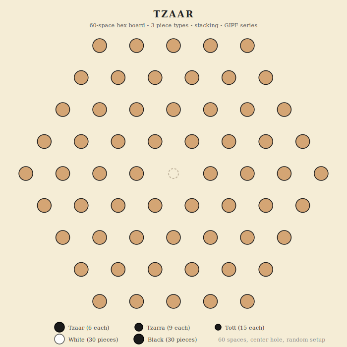

# TZAAR

Hex stacking strategy game - 60 spaces - 3 piece types - GIPF series - 2 players

## Overview

TZAAR is part of the GIPF Project, a series of award-winning abstract strategy games by Kris Burm. It is played on a hexagonal board with 60 intersections (center removed). Each player has 30 pieces across three types. The core tension: you must capture every turn, but capturing reduces your forces. You can stack your own pieces to make them stronger, but that also reduces your count. You lose if any one piece type is completely eliminated from the board.

## Components

One hex board with 60 intersections and a center hole. 60 pieces total (30 per player).

- **White** - 6 Tzaars, 9 Tzarras, 15 Totts (30 pieces)
- **Black** - 6 Tzaars, 9 Tzarras, 15 Totts (30 pieces)

### Piece types

| Type | Count per player | Strength |
|------|-----------------|----------|
| Tzaar | 6 | Highest rank |
| Tzarra | 9 | Middle rank |
| Tott | 15 | Lowest rank |

The type distinction matters only for the losing condition. In play, all pieces move and capture the same way. Strength is determined by **stack height**, not piece type.

## Board Layout



The board is a hexagonal grid with 60 intersections arranged in 4 concentric rings around a central hole (no playable center space). Movement follows 3 axes (6 directions) along the grid lines. Pieces cannot cross the center hole.

- **Ring 1 (innermost):** 6 intersections
- **Ring 2:** 12 intersections
- **Ring 3:** 18 intersections
- **Ring 4 (outermost):** 24 intersections

## Setup

All 60 intersections are filled at the start of the game. The standard setup method:

- Players take turns placing one piece at a time on any empty intersection.
- Continue until all 60 pieces are placed (the board is completely full).
- Alternative: use a fixed starting arrangement (both options are valid).

## Movement

All pieces (and stacks) move in **straight lines** along the hex grid axes (6 directions). A piece/stack moves any number of spaces in one direction, but:

- Cannot jump over other pieces or stacks.
- Cannot cross the empty center hole.
- Must land on either an opponent's piece/stack (capture) or one of your own pieces/stacks (stacking).
- **Cannot land on an empty space** (every move must end on an occupied intersection).

## Turn Structure

**White's first turn:** One mandatory capture only.

**All subsequent turns:** Each turn has **two actions:**

1. **First action (mandatory):** Capture an opponent's piece or stack. This is required. If you cannot make any capture, you lose.
2. **Second action (choose one):**
   - **Capture** another opponent piece/stack, OR
   - **Stack** one of your pieces/stacks onto another of your own, OR
   - **Pass** (end your turn immediately)

## Capture

Move one of your pieces/stacks onto an opponent's piece/stack to capture it. The captured piece/stack is removed from the game entirely.

**Stack height rule:** You can only capture an opponent's piece/stack if your stack is **equal to or taller** than the target.

| Your height | Can capture height |
|-------------|-------------------|
| 1 (single) | 1 only |
| 2 | 1 or 2 |
| 3 | 1, 2, or 3 |
| N | 1 through N |

## Stacking

Move one of your pieces/stacks onto another of your own pieces/stacks. The two combine into a single taller stack.

- **Only the top piece** of a stack determines its type (Tzaar, Tzarra, or Tott).
- There is no height limit for stacks.
- Stacking reduces the number of distinct pieces you have on the board but makes surviving pieces harder to capture.

> **Stacking tradeoff:** A taller stack is harder to capture, but stacking reduces the number of spaces you occupy. If all pieces of one type end up buried in stacks (invisible), you still have them - only the top piece counts as "in play" for the losing condition.

## Winning and Losing

You **lose** if either condition is true at the start of your turn:

1. **Missing a type:** You have no pieces of any one type visible on the board (no Tzaar tops, no Tzarra tops, or no Tott tops showing). Pieces buried in stacks do not count.
2. **Cannot capture:** You cannot make a legal capture for your mandatory first action.

## Draws

There are no draws in TZAAR. One player always loses.

---

## Implementation Notes

### Settings

| Setting | Default | Description |
|---------|---------|-------------|
| Setup method | Random | Random placement or fixed starting position |

### Game state shape

```
{
  accessCode, game: 'tzaar',
  phase: 'waiting' | 'setup' | 'playing' | 'finished',
  players: {
    p1: { token, ip, name, title, captured: 0 },
    p2: { token, ip, name, title, captured: 0 }
  },
  board: {
    'r1n0': { owner: 'p1', type: 'tzaar', height: 1 },
    'r1n1': { owner: 'p2', type: 'tott', height: 2, stack: ['tott', 'tzarra'] },
    ...
  },
  turn: { player: 'p1', action: 1 },  // action 1 = mandatory capture, action 2 = optional
  log: [], logSeq: 0,
  result: null,
  requests: 0
}
```

Board values are objects with `owner`, `type` (top piece type), `height`, and optionally `stack` (array of types from bottom to top).

### Board data model

- **Node naming:** Ring-based: `r{ring}n{index}` where ring is 1-4 and index is 0-based within the ring. Ring 1 has 6 nodes (r1n0-r1n5), ring 2 has 12 (r2n0-r2n11), ring 3 has 18, ring 4 has 24.
- **Adjacency:** Each node connects along 3 axes (6 directions). Nodes on opposite sides of the center hole are NOT connected (cannot cross the hole).
- **Line tracing:** To find legal moves, trace from a node in each of the 6 directions, skipping empty spaces and stopping at the first occupied space. That occupied space is a valid target (capture if opponent, stack if friendly).

### Phase machine

- `waiting` -> player 2 joins -> `setup` (placement phase)
- `setup` -> all 60 pieces placed -> `playing` (white takes first turn, 1 capture only)
- `playing` -> action 1 (capture) -> action 2 (capture/stack/pass)
- `playing` -> turn ends -> check losing conditions -> next player or `finished`

### API endpoints

- `create`, `join`, `state`, `leave`, `stats`, `replay` (standard)
- `place` (node, pieceType) - during setup phase
- `move` (from, to) - during playing phase (handles both capture and stack based on target owner)
- `pass` - end turn after first action

### UI considerations

- Show stack height as a number on each piece/stack.
- Differentiate piece types visually (size, symbol, or label: T/Z/t).
- Show which type each player is missing (approaching loss).
- Highlight that the first action must be a capture (show only capture targets, not stacking options).
- For the second action, show both capture and stacking options with different highlight colors.
